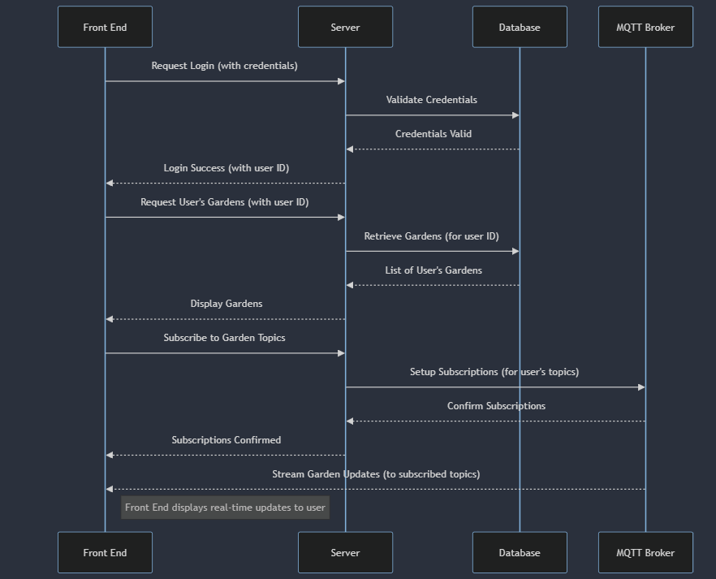
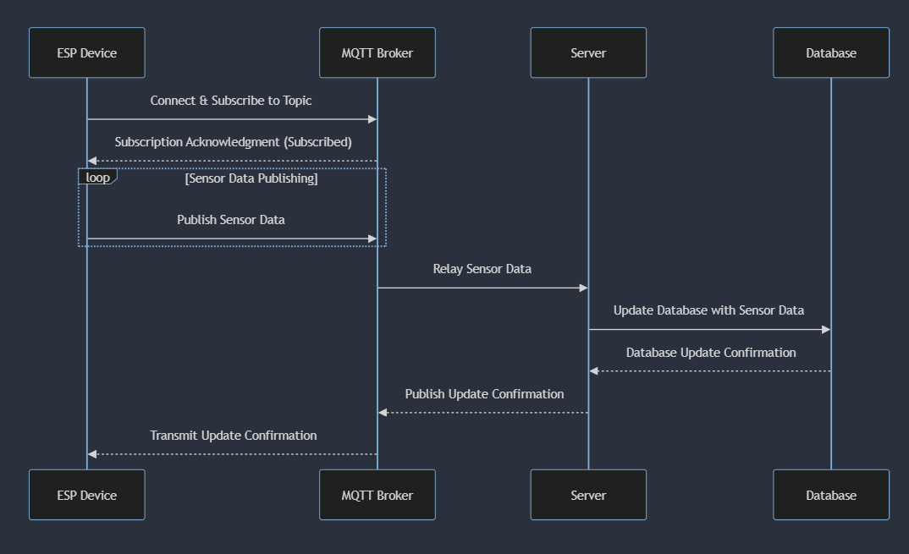

# SmartGarden

O projeto em questão é um sistema de monitoramento de jardins domésticos que utiliza a tecnologia de "gêmeos digitais" para criar uma representação virtual dos processos físicos de um jardim. O sistema emprega um microcontrolador ESP32 equipado com vários sensores para coletar dados ambientais, como temperatura e umidade. Esses dados são enviados via Wi-Fi ou Bluetooth para um servidor Raspberry Pi, que atua como um hub central.

A Raspberry Pi agrega os dados e os disponibiliza através de uma API RESTful, que pode ser acessada por um frontend, como uma aplicação web ou móvel, permitindo aos usuários visualizar e monitorar o estado do jardim em tempo real. A API fornece respostas em JSON com informações detalhadas sobre cada sensor, incluindo suas últimas leituras e o horário em que foram atualizadas.

O objetivo final do sistema é oferecer aos usuários uma maneira conveniente e eficiente de manter a saúde de seus jardins, aproveitando as vantagens dos dispositivos IoT (Internet das Coisas) para coleta e análise de dados. Este tipo de aplicativo tem potencial para ser expandido com funcionalidades adicionais, como automação de irrigação, detecção de pragas e recomendações de cuidados com as plantas, transformando a jardinagem em uma experiência mais gerenciável e científica.

## Hardware
O hardware para o sistema de monitoramento de jardins domésticos é projetado para ser robusto, eficiente e capaz de operar em ambientes externos. O coração do sistema é um microcontrolador ESP32, conhecido pela sua versatilidade, capacidade de Wi-Fi e Bluetooth integrados, e baixo consumo de energia. Vários sensores são conectados ao ESP32 para monitorar as condições do jardim em tempo real, Essa informação vai ser enviada para um Broker MQTT para  ser consumida por todos os serviços escritos no servidor.

 - Microcontrolador: ESP32: Este microcontrolador é a escolha ideal devido à sua conectividade Wi-Fi e Bluetooth, permitindo a comunicação sem fio com o Broker MQTT, que atua como servidor e ponto de coleta e distribuição dos dados.

O modelo do gêmeo digital está diretamente ligado aos atuadores e sensores que o hardware pode ter quanto mais informação mais preciso o modelo. Abaixo está a lista dos principais componentes do hardware e seus respectivos sensores:

 - **Sensor de Temperatura e Umidade do Ar**: Fornece informações sobre a temperatura e umidade do ambiente, fatores críticos para a saúde das plantas.
 - **Sensor de Luz**: Mede a intensidade da luz no jardim, ajudando a entender se as plantas estão recebendo luz solar adequada.
 - **Sensor de Umidade do Solo**: Mede o nível de umidade do solo, essencial para garantir a rega adequada das plantas.
   
O projeto e arquitetura da parte embarcada do sistema será baseado no guia “ESP32-C3 Wireless Adventure A Comprehensive Guide to IoT, Espressif Systems”

## Ubiquidade

A ubiquidade será alcançada no projeto nas partes que interagem e são interagidas pelo usuário, através da implementação do conceito de continuidade. Tarefas, consultas e alterações iniciadas por um usuário em um meio de acesso, por exemplo via aplicativo em um dispositivo smartphone, poderão ser continuadas do mesmo ponto em outras aplicações de acesso ao sistema e até mesmo em dispositivos distintos, sem a perda de dados ou progresso.

Conforme o projeto for sendo desenvolvido e necessidades e oportunidades de aspectos ubíquos surgirem, a equipe, com a ajuda dos professores orientadores, irá gradativamente elevar a ubiquidade do sistema, buscando uma experiência cada vez mais pervasiva e transparente para o usuário final.


## Gêmeo Digital

O conceito de gêmeo digital terá grande presença no Smart Garden, uma vez que constantemente, de forma autônoma e após solicitação do usuário, o sistema irá gerar uma gêmeo digital do jardim monitorado com o máximo de detalhes possível e informações atualizadas, para executar simulações e obter predições de cenários diversos.

Dentre os cenários de predição via gêmeo digital, o sistema conduzirá uma simulação, fundamentada nos dados dos sensores de temperatura, umidade do ar e umidade do solo, para avaliar a saúde da planta ao longo do tempo sem rega. Essa análise resultará em um gráfico temporal que destaca a perda progressiva de saúde da planta com base em uma ponderação desses fatores. Inicialmente, a planta é considerada em seu estado de saúde atual, e a simulação demonstrará de forma visual como a ausência de irrigação impacta significativamente sua condição ao longo do período analisado.

Futuramente, com a integração de mais sensores e a expansão da quantidade de dados coletados, o sistema poderia aprimorar significativamente suas capacidades. A adição de sensores especializados permitiria uma análise mais abrangente das condições ambientais, contribuindo para a precisão das simulações realizadas pelo gêmeo digital. O sistema poderia, por exemplo, incorporar sensores específicos para identificar nutrientes no solo, fornecendo dados mais detalhados sobre a composição do substrato. Além disso, a inclusão de sensores meteorológicos adicionais possibilitaria previsões mais precisas em relação a eventos climáticos, contribuindo para a adaptação proativa do usuário diante de condições adversas.

## Padrões de Interface:

O projeto mantém padrões de interface consistentes em todas as plataformas. Ações realizadas por um botão em um aplicativo móvel devem ser reproduzidas da mesma forma na versão web. A interface é responsiva, preservando a identidade visual e garantindo uma experiência consistente, independentemente da plataforma ou dispositivo utilizado.

## Sincronização de Dados:

Os dados coletados pelos ESP-32 são sincronizados continuamente com o servidor, garantindo que alterações feitas em um dispositivo sejam imediatamente refletidas em outros. Além disso, o sistema é capaz de reconhecer o usuário, mantendo o estado e preferências do mesmo. Por exemplo, se um usuário inicia uma simulação em um smartphone, pode continuar a partir de outro dispositivo sem reiniciar.

## Integração Futura:

O sistema tem potencial para integração futura com serviços como previsão do tempo. Além disso, a possibilidade de utilizar funcionalidades de outros dispositivos, como a câmera de um smartphone para análise de imagens de plantas, permitirá recomendações mais abrangentes e informativas sobre os cuidados com as plantas. Essa integração visa tornar o sistema mais completo e útil para os usuários.


### Mqtt Musquitto WSL:

```sh
sudo apt-get update
```

```sh
sudo apt-get upgrade
``` 

```sh
sudo apt-get install mosquitto
```

```sh
sudo apt-get install mosquitto-clients
```

    Edite o arquivo /etc/mosquitto/mosquitto.conf e adicione as quatro linhas abaixo ao final do arquivo:

    allow_anonymous true
    listener 1883 0.0.0.0

    listener 1884
    protocol websockets

    Em seguida, inicie o servidor Mosquitto executando o comando:
    mosquitto.

### Arquitetura do projeto:


## Diagramas de Sequência:

### Diagrama de Sequência - Login



### Diagrama de Sequência - Esp Update


